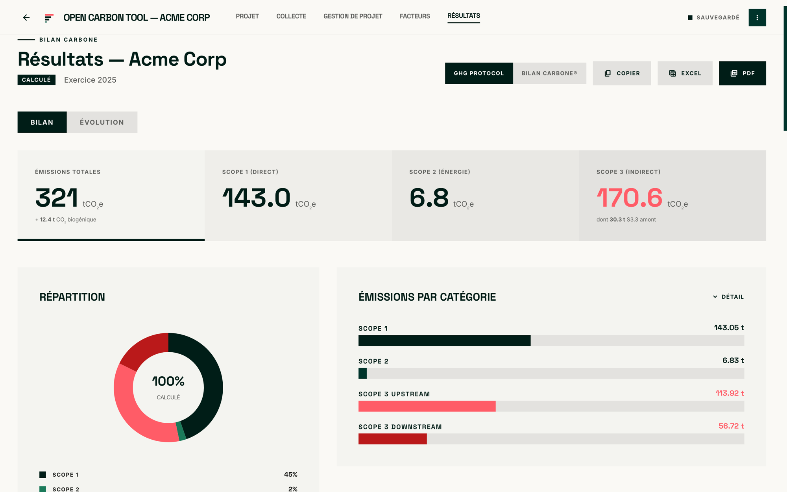
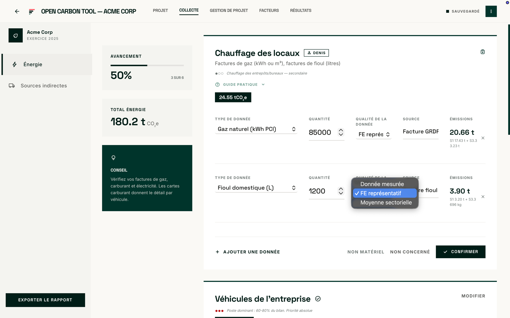

<p align="center">
  
</p>

<h1 align="center">Open Carbon Tool</h1>

<p align="center">
  Application desktop open source et local-first de bilan carbone, éditée par Mobility Transition Lab.
</p>

<p align="center">
  <a href="https://github.com/AubergineB/open-carbon-tool/actions/workflows/build.yml"></a>
  <a href="https://github.com/AubergineB/open-carbon-tool/releases/latest"></a>
  <a href="LICENSE"></a>
  
</p>

Elle aide les PME à structurer un bilan carbone selon le Bilan Carbone® V9 et le GHG Protocol Corporate Standard.

Vos données comptables, RH et opérationnelles restent dans des fichiers JSON sur votre ordinateur. Aucun compte, serveur ou transfert de données n'est nécessaire.

## Capture d'écran

<p align="center">
  
  
</p>

## Installer

Téléchargez la dernière version depuis la page
[releases](https://github.com/AubergineB/open-carbon-tool/releases/latest).

| Système | Fichier |
|---|---|
| macOS (Apple Silicon) | `.dmg` (arm64) |
| macOS (Intel) | `.dmg` (x64) |
| Windows | `.exe` (installation sans droits administrateur) |
| Linux | `.AppImage` ou `.deb` |

Les bundles macOS sont signés Apple Developer ID et notarisés : l'application
s'ouvre au double-clic, sans avertissement. L'installeur Windows n'est pas signé
et déclenche un avertissement SmartScreen ; il s'installe sans droits
administrateur. Voir [INSTALL.md](INSTALL.md).

## Fonctionnalités

**Périmètre et calcul**

- 17 postes d'émission et environ 230 facteurs d'émission intégrés ;
- double restitution Bilan Carbone® V9 et GHG Protocol Corporate Standard, chaque ligne portant les deux catégorisations ;
- Scope 2 en double restitution Location-Based **et** Market-Based : chaque ligne d'électricité apparaît dans les deux colonnes, le mix résiduel étant appliqué automatiquement en l'absence de contrat ;
- émissions amont (Scope 3.3) séparées de la combustion directe, et CO₂ biogénique reporté hors du total GES ;
- niveaux de précision P0 à P3, matérialité sectorielle et contrôles de cohérence ;
- multi-sites, multi-années, avec analyse d'évolution, de découplage et d'intensité (CA, effectif).

**Collecte et pilotage**

- fiches « Guide pratique » par poste, expliquant quoi demander et où trouver la donnée ;
- suivi d'avancement par poste (inactif, actif, écarté, confirmé) et assignation en texte libre ;
- collecte assistée par LLM sans réseau : export d'un gabarit JSON auto-documenté, remplissage par le LLM de votre choix en dehors de l'application, puis import et validation humaine ligne par ligne (voir plus bas) ;
- espace de travail avec cinq convertisseurs sourcés — masse/volume, PCS/PCI, t.km fret, énergie, déchets ;
- documentation méthodologique et FAQ de comptabilité carbone embarquées dans l'application.

**Facteurs d'émission**

- catalogue embarqué consultable, avec source, version et unité pour chaque facteur ;
- création de facteurs personnalisés (valeur, unité, catégorie, source) lorsqu'un facteur manque au catalogue ;
- archivage réversible d'un facteur (personnalisé ou du catalogue) pour le retirer des listes de saisie sans détruire l'historique : les lignes déjà calculées restent lisibles grâce au snapshot du facteur conservé dans le fichier.

**Sorties**

- exports PDF, Excel et JSON ;
- fichiers lisibles, diffables et archivables dans un espace partagé.

## Méthodologie et facteurs

Le catalogue embarqué s'appuie principalement sur la **Base Empreinte de l'ADEME**, version déclarée `ademe-base-empreinte-23.6` et écrite dans chaque fichier de bilan. Le panneau Facteurs référence également les autres bases utilisables pour un facteur personnalisé : GLEC Framework, AIE, DEFRA, EPA, IPCC EFDB, Ember, Exiobase, Eurostat/SDES, Climatiq.

Chaque facteur porte sa source, sa version et son unité (`kgCO₂e` par unité physique ou monétaire). Le moteur de calcul sépare trois composantes qui ne sont jamais confondues :

| Composante | Contenu | Scope |
|---|---|---|
| `emission_t` | combustion directe | 1 |
| `amont_t` | extraction, transport, raffinage | 3.3 |
| `co2b_t` | CO₂ biogénique | reporté séparément, hors total GES |

Le total d'une ligne vaut `emission_t + amont_t`. L'agrégation par scope rattache automatiquement l'amont au Scope 3, et le CO₂ biogénique est agrégé à part.

Le principe méthodologique est qu'aucun chiffre n'est produit sans facteur cité. L'outil ne substitue jamais un proxy silencieux à un facteur manquant : si le facteur n'existe pas, il faut le créer et le sourcer.

## Collecte assistée par LLM, sans réseau

L'application n'embarque **aucun SDK LLM, aucune clé API, aucun appel réseau**. L'assistance passe par un fichier :

1. Open Carbon Tool exporte un gabarit auto-documenté `collecte-gabarit.ocllm.json` ;
2. vous le confiez au LLM de votre choix, en dehors de l'application ;
3. vous réimportez le fichier rempli dans une file de revue ;
4. vous validez ou rejetez chaque ligne proposée ;
5. seules les lignes acceptées sont insérées, et elles sont recalculées avec les facteurs connus de l'application.

Un LLM propose une structuration de données. Il ne devient jamais une source de facteur d'émission.

## Format ouvert

Chaque bilan est enregistré sous la forme `<slug>-<annee>.ocbilan.json`. Le format est documenté dans [docs/FORMAT.md](docs/FORMAT.md).

## Pourquoi local-first ?

Les données restent sur la machine du consultant ou du client. Le dossier peut être placé dans un espace partagé pour collaborer, sans créer de compte ni transmettre les données à un tiers.

## Limites assumées

Open Carbon Tool est un outil de diagnostic et d'aide à la décision. Il ne constitue ni un bilan certifié par l'Association Bilan Carbone, ni un BEGES réglementaire, ni un audit externe.

L'installeur Windows n'est pas signé : SmartScreen affiche un avertissement, qu'il faut écarter manuellement. Voir [INSTALL.md](INSTALL.md).

## Développement

```bash
npm install
npm run dev
```

Pour lancer la fenêtre native Tauri : `npm run tauri:dev`.

| Commande | Effet |
|---|---|
| `npm run dev` | serveur de développement Vite |
| `npm run build` | build production dans `dist/` |
| `npm run preview` | preview du build production |
| `npm run lint` | ESLint |
| `npm run test` | tests Vitest (moteur de calcul, conversions, formats, exports) |
| `npm run tauri:dev` | fenêtre desktop Tauri |
| `npm run tauri:build` | bundles desktop (dmg/msi/AppImage/deb) |

Stack : React 19, Vite 8, Tailwind CSS 4, Tauri v2. Voir [CONTRIBUTING.md](CONTRIBUTING.md) pour les modalités de contribution.

## Licence

MIT — Henri Ducasse, Mobility Transition Lab. Voir [LICENSE](LICENSE).

Toute utilisation est autorisée, y compris commerciale : usage en mission client, modification, fork, redistribution et intégration dans un produit propriétaire. La seule obligation est de conserver la notice de copyright et de licence. Le logiciel est fourni sans garantie.
